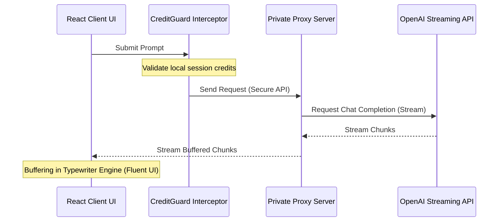

# 🎨 Atelier: Premium AI Context Platform

<div align="center">
  <a href="https://kaif-atelier-ai.vercel.app/" target="_blank">
    
  </a>
  
  
  
</div>

<br />

Atelier is a state-of-the-art independent AI context platform. It is engineered to deliver a fluid, latency-free chat experience while maintaining strict programmatic controls over API credit usage and prompt engineering variables.

---

> ### 🔒 Security & Intellectual Property Note
> This repository is a public showcase of advanced front-end logic, UI/UX systems engineering, and interactive streaming states. **To protect proprietary AI training prompts, backend API keys, payment webhooks, and database schemas, the live backend engine operates on a secure, private repository.** Critical components like the typewriter engine and client-side interceptors are fully open-sourced here, while proprietary LLM tuning code is redacted.

---

## ✨ Features & Capabilities Demoed Here

*   **⚡ Streamwriter Typewriter Rendering Engine**
    *   Smooth React rendering loop that buffers incoming LLM stream chunks.
    *   Eliminates visual "flicker" and integrates typing states + micro-skeleton loaders.
*   **🛡️ CreditGuard Client Interceptor**
    *   Client-side middleware that blocks unauthorized requests if token credits are exhausted.
    *   Saves server resources and prevents token cost runaways.
*   **📂 Contextual Session Organizer**
    *   Date-aware categorization logic dynamically grouping chats into *Today*, *Previous 7 Days*, and *Older*.
    *   Optimized list rendering for seamless navigation.

---

## 🛠️ Tech Stack & Design Architecture

| Layer | Technology | Key Implementation |
| :--- | :--- | :--- |
| **Framework** | Next.js 14 (App Router) | High-performance React framework driving modern streaming routes. |
| **Styling** | Tailwind CSS + Radix UI | Modular, accessible primitives styled with fluid utility classes. |
| **State** | React Context & Hooks | Lightweight, fast state synchronization for active chat sessions. |

---

## 📐 Streaming UX Architecture



---

## ⚙️ Running Locally (Frontend Only)

1. Clone this repository.
2. Install dependencies:
   ```bash
   npm install
   ```
3. Start the development server:
   ```bash
   npm run dev
   ```
